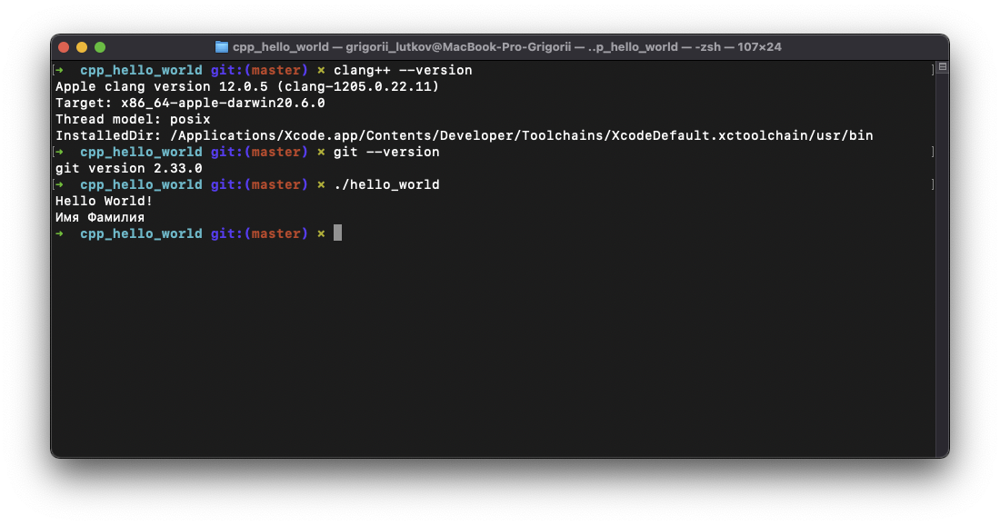

# Задача 1

1. Создать пустой репозиторий на [GitHub](github.com) с названием `cpp_hello_world`.
    - [Docs: Create a Repo](https://docs.github.com/en/get-started/quickstart/create-a-repo)
1. Создать на компьтере папку для проекта с аналогичным названием `cpp_hello_world`, перейти в нее.
1. Инициализировать `git` репозиторий локально, по умолчанию вы окажетесь в ветке `master`:
    - `git init`
      - Docs: [Git](https://git-scm.com/book/en/v2/Git-Basics-Getting-a-Git-Repository), [GitHub](https://github.com/git-guides/git-init), [Atlassian](https://www.atlassian.com/git/tutorials/setting-up-a-repository/git-init)
1. Создайте файлы:
    - `.gitignore`
      - [Docs](https://git-scm.com/docs/gitignore)
    - `README.md`
      - [Docs](https://docs.github.com/en/repositories/managing-your-repositorys-settings-and-features/customizing-your-repository/about-readmes)
1. В `README.md` укажите ваши `Имя Фамилия` как заголовок:
    - `# Имя Фамилия`
5. Добавьте новые файлы в индекс, чтобы `git` отслеживал изменения в них:
    - Вариант 1: перечислить все файлы:
        - `git add .gitignore README.md`
    - Вариант 2: добавляет все файлы по указанному пути:
        - `git add ./` или `git add .`
    - Docs: [Git](https://git-scm.com/book/en/v2/Git-Basics-Recording-Changes-to-the-Repository), [GitHub](https://github.com/git-guides/git-add), [Atlassian](https://www.atlassian.com/git/tutorials/saving-changes)
5. Создайте локально новый `commit` в ветке `master` с названием `Init`.
   Этот `commit` будет включать в себя добавленные выше файлы:
    - `git commit -m "Init"`
      - Docs: [Git](https://git-scm.com/book/en/v2/Git-Basics-Recording-Changes-to-the-Repository), [GitHub](https://github.com/git-guides/git-commit), [Atlassian](https://www.atlassian.com/git/tutorials/saving-changes/git-commit)
6. Добавьте SSH ссылку на связанный удаленный репозиторий GitHub:
    - `git remote add origin git@github.com:username/repository_name.git`
      - Docs: [Git](https://git-scm.com/book/en/v2/Git-Basics-Working-with-Remotes), [GitHub](https://github.com/git-guides/git-remote), [Atlassian](https://www.atlassian.com/git/tutorials/syncing)
7. Отправьте ваши изменения в ветке `master` на GitHub:
    - `git push origin master`
      - Docs: [Git](https://git-scm.com/book/en/v2/Git-Basics-Working-with-Remotes), [GitHub](https://github.com/git-guides/git-push), [Atlassian](https://www.atlassian.com/git/tutorials/syncing/git-push)
8. Создайте новую ветку с названием `hello_world` и переключитесь на неё:
    - Вариант 1: сделать это в 2 действия
        - `git branch hello_world`
        - `git switch hello_world`
    - Вариант 2: короткая форма
        - `git checkout -b hello_world`
    - Docs: [Git](https://git-scm.com/book/en/v2/Git-Branching-Branches-in-a-Nutshell), [Atlassian](https://www.atlassian.com/git/tutorials/using-branches)
9. Создайте простое C++ приложение `hello_world.cpp`, которое будет выводить на экран 2 строки:
    ```cpp
    #include <iostream>

    int main() {
      std::cout << "Hello World!" << std::endl << "Имя Фамилия" << std::endl;
      return 0;
    }
    ```
10. Скомпилируйте его для C++17 c использованием `-Werror` флага (мы будем всегда его использовать в обучающих целях):
    - `clang++ hello_world.cpp -o hello_world -std=c++17 -Werror`
11. Выполните скомпилированную программу:
    - `./hello_world`
12. Создайте локально новый коммит в ветке `hello_world` с названием `Add hello_world app`
13. Запушьте изменения в ветке `hello_world`
15. Переключитесь на ветку `master`
14. Смерджите ветку `hello_world` с веткой `master`
    - `git merge hello_world`
      - Docs: [Git](https://git-scm.com/book/en/v2/Git-Branching-Basic-Branching-and-Merging), [Atlassian](https://www.atlassian.com/git/tutorials/using-branches/git-merge)
15. Запушьте изменения в `master`
16. Очистите командную строку, чтобы не было лишней информации и выполните следующие команды
    - `clang++ --version`
    - `git --version`
    - `./hello_world`
17. Сделайте скриншот окна терминала с полученной информацией.
18. Закоммитьте скриншот в репозиторий.
19. Обновите `README.md` чтобы оно показывало полученный скриншот.
20. Закоммитьте изменения.
21. Отправить ссылку на репозиторий мне для проверки.

# Финал

Следуя основному `Workflow`, описанному [здесь](/tasks), залить выполненную первую задачу в общий групповой репозиторий.

# Пример скриншота


# Время Выполнения

1 Неделя

# Количество Баллов

Вовремя:
- 10 Баллов

# Полезные ссылки:
- `git`
  - [Docs: Git](https://git-scm.com/doc)
  - [Guides: GitHub](https://github.com/git-guides/)
  - [Guides: Atlassian Git](https://www.atlassian.com/git)
- GitHub
  - [Docs](https://docs.github.com/en)
- Markdown
  - [Docs](https://docs.github.com/en/github/writing-on-github/getting-started-with-writing-and-formatting-on-github/basic-writing-and-formatting-syntax)
  - [Guides](https://guides.github.com/features/mastering-markdown/)
- `.gitignore`
  - [Docs](https://git-scm.com/docs/gitignore)
- `README.md`
  - [Docs](https://docs.github.com/en/repositories/managing-your-repositorys-settings-and-features/customizing-your-repository/about-readmes)
