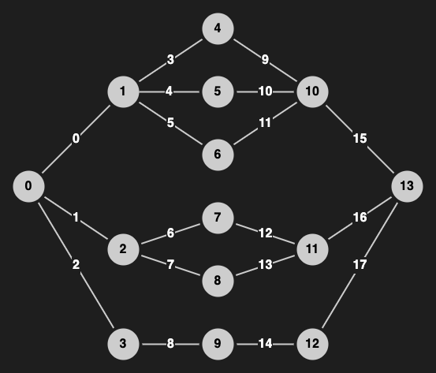

# Задача 1, Финал

1. Сделать форк приватного репозитория, куда вы будете загружать выполненные задачи.
    - Ссылку спросить у меня
2. Создать бранч для загрузки ранее выполненной задачи [task_01](../task_01).
    - Формат названий для бранчей следующий:
      - `name_surname/task_number`
    - Пример:
      - `grigorii_lutkov/task_01`
2. В директории `task_01` создать папку со своим именем на латинице вида `name_surname`.
3. Добавить туда файлы выполненной прежде задачи [task_01](../task_01).
4. Закоммитить и запушить изменения в свой форк на [GitHub](github.com).
5. Создать `pull request` чтобы смерджить изменения в своем форке с основным репозиторием (см. пункт 1).

# Задача 2

## 1. Написать генератор графа.

### Параметры графа:
- И вершины и грани могут иметь дополнительную информацию.
- Неориентированный, можно двигаться в любом направлении.
- Без разъединенных участков, т.е. от первой вершины можно добраться до любой другой.
- Вершина может быть соединена с самой собой.

Интерфейс и имплементация за вами, дерзайте!

### Визуализация графа, который вы должны сгенерировать:


## 2. Реализовать текстовый вывод графа в файл в формате `JSON`:
```json
{
  "vertex": {
    "vertex_num": 1,
    "edges": [
      {
        "edge_num": 1,
        "vertex": {
          "vertex_num": 2,
          "edges": [
            // ...
          ]
        }
      }, {
        "edge_num": 2,
        "vertex": {
          "vertex_num": 3,
          "edges": [
            // ...
          ]
        }
      }, {
        // ...
      }
    ]
  }
}
```

Можно в одну строку, главное, чтобы структура совпадала и `JSON` был валидный:
```json
{ "vertex": { "vertex_num": 1, "edges": [{ "edge_num": 1, "vertex": { /* ... */ }}, /* ... */ ]}}
```

> Подсказка: по идее, генерацию текста легко можно сделать с помощью рекурсии
